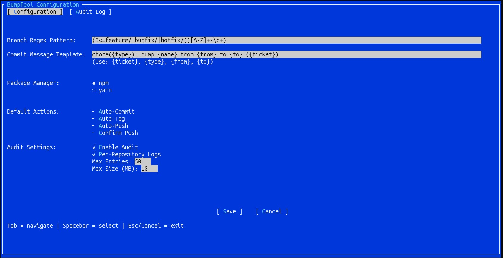
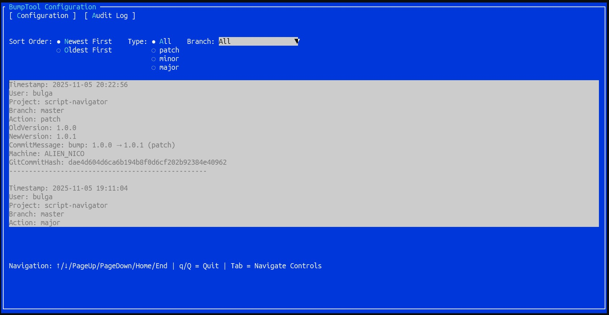
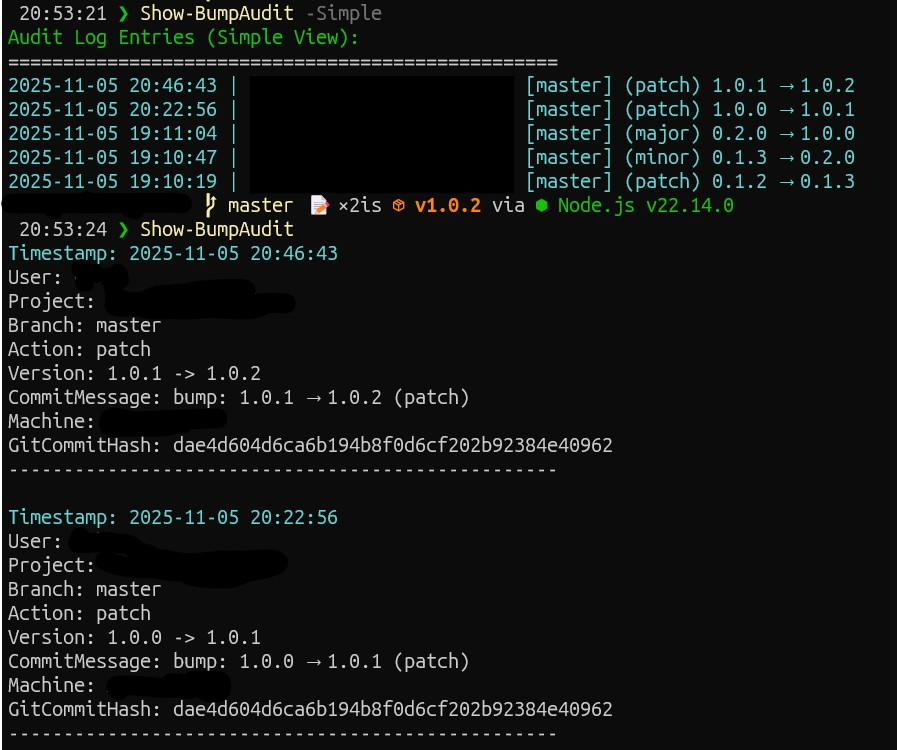

# BumpTool

A powerful PowerShell utility for automating `package.json` version bumps with customizable commit messages, optional Git integration, and smart branch parsing.

---

## Features

* **Fast Aliases:** Use `bump-patch`, `bump-minor`, or `bump-major` directly in your project root.
* **Configurable TUI:** Customize settings via `Set-BumpConfig` using a terminal GUI.
* **Smart Branch Parsing:** Automatically extract ticket numbers (e.g., `PROJ-123`) from branch names using Regex.
* **Conventional Commit Messages:** Flexible commit message templates using placeholders like `{ticket}`, `{type}`, `{from}`, `{to}`, and `{name}`.
* **Full Automation:** Optionally auto-commit, auto-tag, and auto-push each bump.
* **Package Manager Support:** Compatible with npm and yarn.
* **Audit Logs:** Track all bump operations with filtering, export, and rotation support.

---

## Installation

### Prerequisites

Install the TUI framework dependency first:

```powershell
Install-Module Microsoft.PowerShell.ConsoleGuiTools -Scope CurrentUser
```

> Required for BumpTool's interactive configuration UI.

### Option A: Manual Install (From Source)

1. Clone the repository or download the ZIP archive.
2. Place the `BumpTool` folder (containing `BumpTool.psd1`) in a PowerShell module path, for example:
   `C:\Users\<YourUser>\Documents\PowerShell\Modules\`
3. Unblock the files:

```powershell
Get-ChildItem -Path "$env:USERPROFILE\Documents\PowerShell\Modules\BumpTool" -Recurse | Unblock-File
```

4. Import the module to test:

```powershell
Import-Module BumpTool
```

### Option B: PowerShell Gallery (Coming Soon)

```powershell
Install-Module BumpTool -Scope CurrentUser
```

---

## CLI Aliases

| Command          | Description                                       |
| ---------------- | ------------------------------------------------- |
| `bump-patch`     | Increment the patch version (e.g., 1.2.3 → 1.2.4) |
| `bump-minor`     | Increment the minor version (e.g., 1.2.3 → 1.3.0) |
| `bump-major`     | Increment the major version (e.g., 1.2.3 → 2.0.0) |
| `Set-BumpConfig` | Launch the interactive configuration UI (TUI)     |
| `Show-BumpAudit` | Display audit logs for version bump operations    |

> Tip: Combine flags with bump commands, e.g., `bump-minor -Commit -Tag`.

---

## Interactive TUI

The configuration UI (`Set-BumpConfig`) allows you to quickly customize all settings without editing JSON manually.



* Navigate with arrow keys, toggle checkboxes with spacebar.
* Press `Enter` to edit text fields.
* Press `Ctrl + Q` to exit the TUI.




---

## Quick Start Workflow

```
        ┌───────────────┐
        │ Navigate to   │
        │ project root  │
        └───────┬───────┘
                │
                ▼
        ┌───────────────┐
        │ Run bump-xxx  │
        │ (patch/minor/ │
        │ major)        │
        └───────┬───────┘
                │
                ▼
   ┌───────────────────────┐
   │ Update package.json   │
   │ and version number    │
   └───────┬───────────────┘
           │
           ▼
   ┌───────────────────────┐
   │ Extract ticket from   │
   │ branch via regex      │
   └───────┬───────────────┘
           │
           ▼
   ┌───────────────────────┐
   │ Generate commit       │
   │ message from template │
   └───────┬───────────────┘
           │
           ▼
   ┌───────────────────────┐
   │ Auto-commit?          │
   │ (if enabled)          │
   └───────┬───────────────┘
           │
           ▼
   ┌───────────────────────┐
   │ Auto-tag version?      │
   │ (if enabled)           │
   └───────┬───────────────┘
           │
           ▼
   ┌───────────────────────┐
   │ Auto-push?             │
   │ (if enabled & confirmed) │
   └───────┬───────────────┘
           │
           ▼
   ┌───────────────────────┐
   │ Write audit log entry  │
   │ ($env:USERPROFILE\...\logs\<Repo>) │
   └───────────────────────┘
```

**Legend:**

* Optional steps depend on your TUI configuration (`AutoCommit`, `AutoTag`, `AutoPush`, `ConfirmPush`).
* Audit logs are always written if enabled.

---

## Usage Guide

### Step 1: Configure Settings

Run the TUI at least once to customize your workflow:

```powershell
Set-BumpConfig
```

### Step 2: Daily Workflow

```powershell
# Increment patch version (1.2.3 → 1.2.4)
bump-patch

# Increment minor version (1.2.3 → 1.3.0)
bump-minor

# Increment major version (1.2.3 → 2.0.0)
bump-major
```

### Step 3: Advanced Usage

```powershell
# Force commit and tag for this operation
bump-minor -Commit -Tag

# Dry run
bump-patch -WhatIf

# Override global commit/tag settings
bump-patch -Commit:$false -Tag:$false
```

---

## Configuration Reference

Settings are stored in:

```
$env:USERPROFILE\Documents\BumpTool\bump-config.json
```

Edit interactively using:

```powershell
Set-BumpConfig
```

| Setting                   | Description                                                                                  | Default                                                     |
| ------------------------- | -------------------------------------------------------------------------------------------- | ----------------------------------------------------------- | 
| **PackageManager**        | Package manager to use (`npm`, `yarn`, or `auto`)                                            | `auto`                                                      |     |     |
| **AutoCommit**            | Automatically commit version bump                                                            | `false`                                                     |     |     |
| **AutoTag**               | Automatically tag new version                                                                | `false`                                                     |     |     |
| **AutoPush**              | Automatically push commits/tags                                                              | `false`                                                     |     |     |
| **ConfirmPush**           | Require confirmation before pushing                                                          | `false`                                                     |     |     |
| **CommitTemplate**        | Template for commit messages. Placeholders: `{ticket}`, `{type}`, `{from}`, `{to}`, `{name}` | `chore({type}): bump {name} from {from} to {to} ({ticket})` |     |     |
| **BranchRegex**           | Regex to extract ticket IDs from branch names                                                | `(?<=feature/\|bugfix/\|hotfix/)([A-Z]+-\d+)`               |
| **Audit.Enabled**         | Enable audit logging                                                                         | `true`                                                      |     |     |
| **Audit.SeparatePerRepo** | Keep separate logs per repository                                                            | `true`                                                      |     |     |
| **Audit.MaxSizeMB**       | Maximum log file size before rotation                                                        | `10`                                                        |     |     |
| **Audit.MaxEntries**      | Maximum number of audit entries per log                                                      | `500`                                                       |     |     |

---

## Audit Logs

### Viewing Logs

```powershell
Show-BumpAudit [-Export] [-Format <string>] [-Simple] [<CommonParameters>]
```

**Options:**

* `-Export` – Export logs to file instead of displaying.
* `-Format` – File format when exporting (`json` or `csv`). Default: `json`.
* `-Simple` – Show concise single-line logs.
* `-Repository` – Optional, specify a repository name; defaults to the current folder.

**Example:**

```powershell
# Show detailed logs
Show-BumpAudit

# Show concise logs
Show-BumpAudit -Simple

# Export logs to JSON
Show-BumpAudit -Export -Format json

# Export logs to CSV
Show-BumpAudit -Export -Format csv
```




**Audit Log Path:**

```
$env:USERPROFILE\Documents\BumpTool\logs\<Repository>\bump-audit.json
```

---

## License

This project is licensed under the MIT License. See LICENSE for details.
